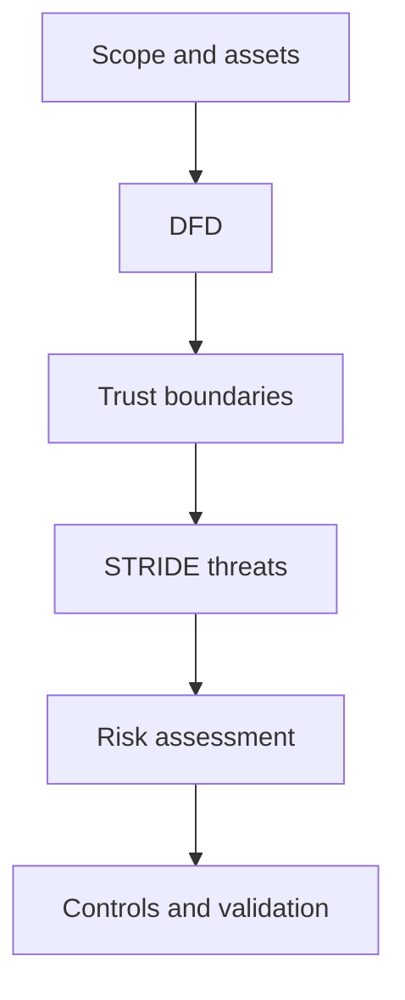
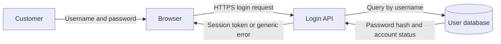

# Threat Modeling with DFD, Trust Boundaries, and STRIDE

> A GitHub-ready revision guide for interviews and practical threat-modeling sessions.

## 1. The Complete Workflow

Use this sequence instead of randomly brainstorming attacks:

1. **Define scope and assumptions**
2. **Identify assets and security objectives**
3. **Create a Data-Flow Diagram (DFD)**
4. **Mark trust boundaries**
5. **Apply STRIDE systematically**
6. **Write concrete threat scenarios**
7. **Assess likelihood, impact, and existing controls**
8. **Map a specific control to every threat**
9. **Evaluate residual risk and tradeoffs**
10. **Prioritize, assign an owner, and validate controls**



## 2. Data-Flow Diagrams

An architecture diagram shows what exists. A DFD shows where data enters, moves, changes, rests, and exits.

### Four DFD elements

| Element | Meaning | Example |
|---|---|---|
| External entity | A person or system outside the modeled system | Customer, external bank |
| Process | Receives or transforms data | Login API, payment service |
| Data store | Preserves data | User database, audit-log store |
| Data flow | Information moving between elements | Credentials, session token |

Memory rule:

> Components do work or hold data. Data flows are the information moving between them.

Do not label an arrow only as `request`. Name the actual data, such as `username + password`, `payment instruction`, or `session token`.

### Login DFD example



Always include important return flows. A transaction is usually a conversation, not a one-way chain.

## 3. Trust Boundaries

A trust boundary exists where data crosses between areas with different control, exposure, identity guarantees, privileges, or security policies.

Ask:

> Did the data enter a place where the system must make a new trust decision?

### Login example

| Boundary | Why trust changes | Required decision |
|---|---|---|
| Untrusted client → Internet-facing application | The user controls the browser; the company controls the API | Validate input and authenticate the claimed identity |
| Internet-facing application → Restricted data zone | The API handles hostile input; the database stores sensitive records | Authenticate the workload and authorize only required operations |
| Company system → Third party | Ownership, policies, retention, and access change | Minimize shared data and restrict third-party access |

Same organization, AWS account, or network does not automatically mean the same trust zone. Base boundaries on actual privilege and control.

IP allowlisting can restrict network access, but an IP address alone does not prove workload identity. Use authentication, strong workload identity, and least privilege too.

## 4. STRIDE

STRIDE provides six systematic security questions.

| Letter | Threat | Security property | Core question |
|---|---|---|---|
| S | Spoofing | Authentication | Can someone falsely claim an identity? |
| T | Tampering | Integrity | Can someone change data or code without authorization? |
| R | Repudiation | Accountability | Can someone deny an action because reliable evidence is missing? |
| I | Information Disclosure | Confidentiality | Can someone learn information they should not know? |
| D | Denial of Service | Availability | Can someone exhaust or block a limited resource? |
| E | Elevation of Privilege | Authorization | Can an identity gain capabilities beyond its intended authority? |

### Spoofing versus Elevation of Privilege

| Scenario | Classification |
|---|---|
| An attacker uses Arif's stolen session token | Spoofing: “I am someone else.” |
| An attacker uses their own account but changes `account_id` to access Arif's records | Elevation of Privilege / BOLA: “I am myself, but I can do something I should not.” |

Authentication asks **who are you?** Authorization asks **what are you allowed to do?**

## 5. Login-System Examples

### S — Spoofing

**Threat:** An attacker uses credentials leaked from another website to impersonate a customer.

**Primary control:** Phishing-resistant MFA, such as passkeys or security keys.

**Tradeoff:** Additional login friction, account-recovery complexity, and support costs.

### T — Tampering

**Threat:** An attacker changes a client-controlled `redirect_url` to an attacker-owned site.

**Primary control:** Accept relative paths or exact server-side allowlisted destinations.

**Tradeoff:** New legitimate destinations require policy changes; dynamic applications are harder to support.

TLS prevents network modification, but it cannot stop users from changing values inside their own browsers. Server-side validation remains necessary.

### R — Repudiation

**Threat:** An administrator resets a user's MFA, later denies it, and the only log says `MFA reset successful`.

**Primary control:** Tamper-resistant audit logging stored outside the actor's ability to modify or delete it.

Essential fields:

```text
timestamp
actor_id
target_id
action
reason
ticket_or_approval_id
result
request_id
source_ip
authentication_method
```

**Tradeoff:** Logs cost money and may contain personal data. Apply encryption, access controls, retention limits, and deletion policies.

Logging records what the system observed; it does not automatically prove who was physically using the account.

### I — Information Disclosure

**Threat:** The Login API receives home address and date of birth even though login does not require them. Those fields may leak through logs, traces, memory dumps, or a compromised API.

**Primary control:** Data minimization—query and return only required fields.

```sql
SELECT password_hash, mfa_configuration, account_status, role
FROM users
WHERE email = ?;
```

**Tradeoff:** Queries and permissions must be updated when legitimate requirements change.

Key lesson:

> If the API never receives unnecessary data, compromising the API cannot disclose that data.

Encryption at rest protects stolen storage and snapshots, but it does not protect data that a compromised API is authorized to decrypt.

#### Account enumeration

Different responses such as `Unknown email` and `Incorrect password` reveal which accounts exist.

Use a normalized response:

```text
Invalid username or password.
```

Keep the message, status code, body size, and ideally timing consistent. Rate-limit enumeration attempts as well.

### D — Denial of Service

**Threat:** Distributed login attempts consume CPU for password hashing, database connections, memory, worker capacity, request queues, and bandwidth.

**Primary control:** Risk-aware rate limiting.

A simple per-IP limit can be bypassed with proxies or botnets and can block legitimate users sharing one IP.

Use progressive throttling based on multiple signals:

```text
Initial failures → normal response
More failures → increasing delay
High risk → step-up verification
Extreme activity → temporary restriction and alert
```

**Tradeoff:** More engineering complexity and possible friction for legitimate users.

Avoid permanent lockout after a few failures. An attacker could intentionally lock out the victim. Highly sensitive systems may use short temporary lockouts with notification and secure recovery.

### E — Elevation of Privilege

**Threat:** The Login API needs to read authentication fields and update a failed-login counter, but its database account can modify roles, reset passwords, delete users, and drop tables. SQL injection lets an attacker inherit those excessive permissions.

**Primary controls:**

- Parameterized queries prevent input from becoming executable SQL.
- A dedicated least-privilege database role limits the damage if injection or API compromise occurs.

Audit logging alone is insufficient because it detects or investigates actions but does not prevent them.

**Tradeoff:** Granular roles require maintenance, can initially break application behavior, and must evolve with new features and migrations.

## 6. Writing High-Quality Threats

Do not write only:

```text
API — Tampering
```

Write a concrete scenario:

```text
An authenticated customer modifies account_id in the profile request.
Because the API does not verify object ownership, the customer reads another
user's record, causing unauthorized disclosure of PII.
```

A useful threat statement identifies:

- Threat actor or starting identity
- Entry point or affected flow
- Action or technique
- Missing or failed security condition
- Asset affected
- Security impact

Template:

> `[Actor]` can `[action]` through `[component or data flow]` because `[weakness]`, causing `[impact to asset/security property]`.

## 7. Mapping Controls

Every accepted threat should have a specific control and enforcement point.

| Threat | Control | Enforcement point | Control type |
|---|---|---|---|
| Stolen password | Phishing-resistant MFA | Identity service | Preventive |
| Modified redirect URL | Exact allowlist | Login API | Preventive |
| Denied MFA reset | Tamper-resistant audit event | API and logging platform | Detective |
| Unnecessary PII returned | Column-level data minimization | Database query/repository layer | Preventive |
| Login flood | Progressive, risk-aware throttling | Gateway/authentication service | Preventive |
| Excessive database permission | Dedicated least-privilege DB role | Database | Preventive |

Controls may be:

- **Preventive:** stop the action
- **Detective:** identify the action
- **Corrective:** restore or limit damage afterward

Do not merely write `validate input`. State what is validated, against which policy, and where enforcement happens.

## 8. Risk and Residual Risk

For each threat, record:

| Field | Question |
|---|---|
| Likelihood | How feasible and probable is the attack? |
| Impact | What happens to users, data, money, operations, or compliance? |
| Existing controls | What already reduces likelihood or impact? |
| Proposed control | What additional action is required? |
| Residual risk | What risk remains after the control? |
| Owner | Who is responsible for remediation? |
| Validation | How will we prove the control works? |

No control eliminates all risk. For example, MFA reduces password-based spoofing, but phishing, recovery abuse, or session theft may remain.

## 9. Interview-Ready Answer

> First, I define the scope, assumptions, assets, and security objectives. Then I create a DFD showing external entities, processes, data stores, named data flows, and trust boundaries. I systematically apply STRIDE to the relevant elements and write each finding as a concrete attack scenario. I assess its likelihood, impact, existing controls, and residual risk. Finally, I map specific controls to each threat, identify where they must be enforced, prioritize remediation, assign ownership, and validate that the controls work.

Short memory sequence:

```text
Scope → Assets → DFD → Trust Boundaries → STRIDE
      → Concrete Threats → Risk → Controls → Validation
```

## 10. Practical Checklist

### Scope

- [ ] Feature and system boundaries are defined
- [ ] Assumptions and exclusions are recorded
- [ ] Important assets and security objectives are identified

### DFD

- [ ] External entities are shown
- [ ] Processes are shown
- [ ] Data stores are shown
- [ ] Data flows are named and directional
- [ ] Important return flows are included

### Trust

- [ ] Changes in ownership and control are marked
- [ ] Changes in exposure and privilege are marked
- [ ] Authentication and authorization decisions are identified
- [ ] Third-party flows are examined

### Threats and controls

- [ ] STRIDE was applied systematically
- [ ] Threats are concrete scenarios, not category labels
- [ ] Every threat maps to a specific control
- [ ] The enforcement component is named
- [ ] Tradeoffs and residual risk are documented
- [ ] High-risk work has an owner and priority
- [ ] A validation or test method is defined

## Final Mental Model

- **DFD:** Where does data enter, move, change, rest, and exit?
- **Trust boundary:** Where must the system make a new trust decision?
- **STRIDE:** What kind of security failure should we test?
- **Threat scenario:** Exactly how could the failure occur, and what would it harm?
- **Control:** What prevents, detects, or corrects it—and where is it enforced?
- **Residual risk:** What remains after the control is implemented?

